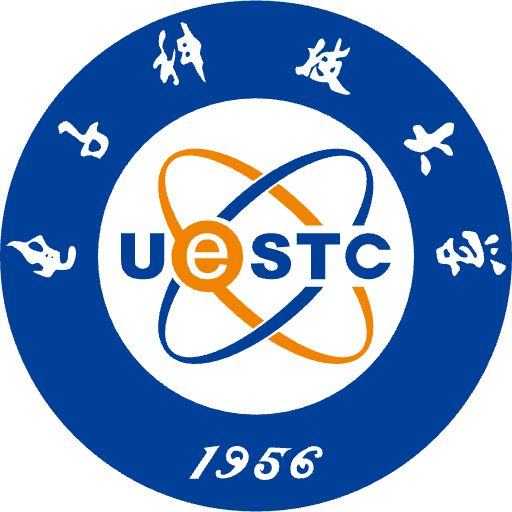

<h1 id="about-me"></h1>

<h2 style="margin: 60px 0px 10px;">Short Bio</h2>

I am currently a Research and Development Engineer at  [ByteDance](https://www.bytedance.com/). I received my M.S. in Computer Science at  [Fudan University](https://www.fudan.edu.cn/), where I was fortunate to be advised by [Prof. Yanwei Fu](http://yanweifu.github.io/) and [Prof. Xiangyang Xue](https://scholar.google.com.hk/citations?user=DTbhX6oAAAAJ). I was also lucky to be mentored by [Dr. Yinda Zhang](https://www.zhangyinda.com/) from 2018 to 2021.
Prior to this, I obtained my bachelor’s degree from  [UESTC](https://www.uestc.edu.cn/).

My research lies at the intersection of **computer vision** and **computer graphics** -- with a special focus on building a virtual representation of physical objects, person and environment. My research interests include **3D reconstruction**, **neural rendering**, and **digital human**.
Please feel free to contact me if you are interested in academic cooperation.






